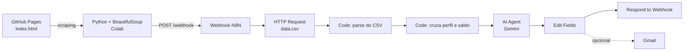
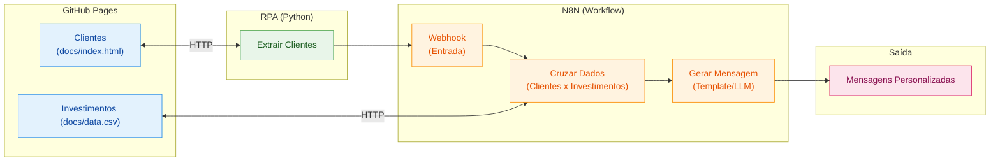

# Assistente de Investimentos com RPA e IA Generativa

# Pipeline de automação que coleta dados de clientes em uma página web com Python (RPA), orquestra o processamento no N8N e gera mensagens de recomendação personalizadas para cada perfil de investidor usando um Agente de IA (Gemini).

Projeto desenvolvido para o desafio da DIO. Todos os dados de clientes são fictícios.

Demonstração
🎥 Vídeo: [COLE_AQUI_O_LINK_DO_VIDEO](https://drive.google.com/file/d/1Hb_ZP6cnB3X7LCh6J8lX7US2CKgEceT2/view?usp=sharing)
🖼️ Prints: 

## Visão geral

O fluxo faz quatro coisas:

1. **Coleta** os clientes (nome, email, saldo e perfil) de uma página HTML hospedada no GitHub Pages, via web scraping com Python.
2. **Envia** os dados por POST para um Webhook do N8N.
3. **Cruza** o perfil de cada cliente (Conservador, Moderado ou Arrojado) com as opções do `data.csv`, considerando o saldo disponível.
4. **Gera** uma mensagem personalizada para cada cliente com um Agente de IA e devolve o resultado na resposta do Webhook.

## Arquitetura



## Tecnologias

| Etapa | Ferramenta | Função |
|---|---|---|
| Hospedagem | GitHub Pages | Servir a página de clientes e o CSV de investimentos |
| Extração (RPA) | Python + BeautifulSoup | Coletar os dados dos clientes via web scraping |
| Orquestração | N8N Cloud | Receber, processar e cruzar os dados |
| Geração de texto | AI Agent + Google Gemini Chat Model | Criar mensagens personalizadas |

## Estrutura do repositório

```
📁 dio-lab-assistente-investimentos-rpa-n8n/
├── 📄 README.md
├── 📁 src/
│   └── 📄 extrair_clientes.ipynb   # Scraping + envio ao Webhook do N8N
├── 📁 n8n/
│   └── 📄 workflow.json            # Workflow exportado (com AI Agent)
└── 📁 docs/
    ├── 📄 index.html               # Página de clientes
    └── 📄 data.csv                 # Opções de investimento por perfil
```

## Como executar

1. Faça um **fork** deste repositório e ative o **GitHub Pages** na pasta `/docs`.
2. No **N8N**, importe o arquivo `n8n/workflow.json` (menu `⋯` > *Import from File*).
3. Crie as credenciais no N8N:
   - **Google Gemini (PaLM) API**: chave gerada no Google AI Studio.
   - **Gmail OAuth2** (opcional, só se for usar o envio de email).
4. Confira no node **HTTP Request** se a URL aponta para o seu `data.csv` no GitHub Pages.
5. **Ative o workflow** e copie a URL de **Production** do node Webhook.
6. Abra `src/extrair_clientes.ipynb` no Google Colab, cole a URL em `N8N_WEBHOOK` e execute.
7. Acompanhe a execução na aba *Executions* do N8N.

> **Atenção:** a URL `/webhook-test/` só funciona com o botão *Listen for test event* ativo e aceita uma chamada por vez. Para o uso normal, use `/webhook/` com o workflow ativo.

Atenção: a URL /webhook-test/ só funciona com o botão Listen for test event ativo e aceita uma chamada por vez. Para o uso normal, use /webhook/ com o workflow ativo.

Decisões técnicas
Por que isso é RPA

O script Python faz o que uma pessoa faria manualmente: abre uma página, lê uma tabela e leva os dados para outro sistema. Essa abordagem é útil quando não existe API disponível ou quando é preciso integrar sistemas legados.

Cruzamento de perfil e opções dentro do código

O CSV e o POST do Python chegam ao N8N como itens diferentes: 1 item (a lista inteira de clientes) e 9 itens (uma linha por produto). Um node Merge por posição não resolve isso, porque o que se precisa é de 1 item por cliente. A solução foi usar dois nodes Code: um para converter o CSV em itens e outro para percorrer a lista de clientes e montar, para cada um, as opções adequadas.

Filtro por saldo mínimo

Cada produto do CSV tem um valor mínimo de investimento. O código só inclui na lista produtos do mesmo perfil do cliente cujo mínimo seja menor ou igual ao saldo dele. Isso evita recomendar, por exemplo, um fundo de R$ 5.000 para quem tem R$ 3.200. O código também normaliza o formato do saldo (por exemplo, R$ 5.000,00 ou 5000) antes de comparar.

Mensagem estática como base e IA como camada final

O MVP gera mensagens por template fixo, por perfil. O node Code mantém esse texto no campo mensagem_estatica, mas a saída final usa o texto do agente. Dessa forma o fluxo tem uma base de referência para comparação.

AI Agent com Gemini

O node AI Agent recebe, para cada cliente, nome, perfil, saldo e a lista de produtos já filtrada. Dois motivos para fazer o filtro antes do agente:

O agente só enxerga produtos válidos, o que reduz o risco de ele inventar produtos ou rentabilidades.
A regra de negócio (saldo mínimo) fica em código determinístico, e a IA cuida só da redação.
Prompt do agente

System Message

Você é um assistente de investimentos de uma instituição financeira. Escreva mensagens curtas (máximo 4 frases), em português do Brasil, com tom cordial e profissional. Use SOMENTE os produtos da lista fornecida, sem inventar produtos ou rentabilidades. Nunca prometa retorno garantido; em renda variável, mencione o risco. Responda apenas com o texto da mensagem.

User Message

Cliente: {{ $json.nome }}
Perfil de investidor: {{ $json.perfil }}
Saldo: {{ $json.saldo }}
Produtos disponíveis para ele: {{ $json.opcoes }}

Escreva a mensagem de recomendação para esse cliente.

As restrições do prompt (usar só a lista, não prometer retorno, citar risco em renda variável) existem porque o texto é financeiro.

Reaproveitando nome e email depois do agente

O AI Agent devolve apenas o campo output. Para recuperar nome, email e perfil, o node Edit Fields busca os dados no node anterior usando $('Code in JavaScript1').all()[$itemIndex]. A expressão .item não funcionou, porque o node Code cria itens novos sem vínculo com os itens de entrada.

Respond to Webhook

O workflow termina com Respond to Webhook configurado para devolver todos os itens, e o Python recebe as mensagens geradas na própria resposta. Como o agente faz uma chamada ao LLM por cliente, o script define timeout=120 na requisição.

Envio por email (opcional)

Há um node Gmail ligado depois do Edit Fields. Ele não faz parte dos entregáveis do desafio. Para a demonstração, o destinatário deve ser o email do próprio autor, já que os emails dos clientes são fictícios.

## Limitações e próximos passos

- **Dados fictícios:** a página de clientes é estática. Num cenário real, a fonte seria um sistema interno ou uma API.
- **Sem validação da saída do LLM:** um próximo passo seria checar, antes de enviar, se a mensagem cita apenas produtos da lista.
- **Vínculo por ordem dos itens:** a ligação entre cliente e mensagem depende do `$itemIndex`. Se o fluxo passar a processar itens em paralelo ou fora de ordem, seria melhor carregar um identificador do cliente até o final.
- **Limite do plano gratuito do Gemini:** há um limite de requisições por minuto. Com mais clientes, seria necessário processar em lotes, com espera entre as chamadas.
- **Aviso:** as mensagens são exemplos de comunicação automatizada e **não constituem recomendação de investimento**.

# Autor

Seu Nome LinkedIn: www.linkedin.com/in/andress-zampili-de-moura-16b943304 · GitHub:[(https://github.com/AndressZampili)](https://github.com/AndressZampili)


# Desafio da DIO


# Criando um Assistente de Investimentos com RPA e IA Generativa

## Descrição

Aprenda na prática como criar um fluxo de automação inteligente combinando técnicas de RPA (Robotic Process Automation) com workflows de IA no N8N.

Neste desafio, você vai construir um assistente de investimentos automatizado. O fluxo começa com a extração de dados de clientes em uma página web usando Python, passa pela orquestração de um workflow no N8N e termina com a geração de mensagens personalizadas para cada perfil de investidor.

O projeto foi pensado para ser simples e acessível, mesmo para quem está dando os primeiros passos em Python e automação. A ideia é que você entenda o conceito de RPA de forma leve e aplique tudo em um cenário realista do mercado financeiro.

## Objetivo do Projeto

Desenvolver um pipeline de automação que:

1. **Coleta dados de clientes** de uma página web simulada usando Python
2. **Processa as informações** através de um workflow no N8N
3. **Cruza perfis de investidor** com uma base de opções de investimento
4. **Gera mensagens personalizadas** para cada cliente

Ao final, você terá um sistema funcional que demonstra como empresas do setor financeiro podem automatizar a comunicação com clientes de forma inteligente.

## Arquitetura do Projeto



## Tecnologias e Ferramentas

O projeto utiliza ferramentas gratuitas e acessíveis, organizadas conforme cada etapa do fluxo:

| Etapa | Ferramenta | Função |
|-------|-----------|--------|
| Hospedagem | GitHub Pages | Servir a página de clientes e o CSV de investimentos |
| Extração (RPA) | Python + BeautifulSoup | Coletar dados dos clientes via web scraping |
| Orquestração | N8N | Processar dados, cruzar perfis e gerar mensagens |
| Geração com IA | Agente de IA no N8N | Criar mensagens personalizadas com LLM (desafio extra) |

Além dessas, você pode usar IAs generativas como **Gemini**, **Claude** ou **ChatGPT** como copilotos para auxiliar na escrita de código e tirar dúvidas ao longo do desenvolvimento.

## Roteiro do Desafio

### Etapa 1: Entenda o Projeto

Antes de começar, explore o repositório base que já contém a estrutura inicial:

1. **Página de Clientes (`docs/index.html`):** Uma página HTML hospedada no GitHub Pages com uma lista de clientes fictícios contendo nome, email, saldo e perfil de investidor (Conservador, Moderado ou Arrojado). Disponível online [neste link](https://digitalinnovationone.github.io/dio-lab-assistente-investimentos-rpa-n8n).
2. **Dados de Investimentos (`docs/data.csv`):** Um arquivo CSV também hospedado no GitHub Pages com opções de investimento organizadas por perfil. Disponível online [neste link](https://digitalinnovationone.github.io/dio-lab-assistente-investimentos-rpa-n8n/data.csv).
3. **Script de RPA (`src/extrair_clientes.ipynb`):** Um notebook Python que acessa a página de clientes e extrai os dados da tabela usando BeautifulSoup.

> 🤖 **Por que o script é considerado RPA?** Ele faz exatamente o que um humano faria manualmente: abre uma página, lê os dados de uma tabela e os envia para outro sistema. A diferença é que o "robô" (código) executa isso automaticamente. Essa abordagem é útil quando não existe uma API disponível ou quando precisamos integrar sistemas legados.

### Etapa 2: Configure o Ambiente

1. Faça um **fork** do repositório base para sua conta do GitHub
2. Crie uma conta no [N8N Cloud](https://n8n.io/) ou instale localmente
3. Abra o notebook `src/extrair_clientes.ipynb` no [Google Colab](https://colab.research.google.com/) e execute para entender o fluxo de extração

> 💡 **Atenção:** O script já extrai os dados, mas o envio ao N8N está comentado (`TODO`). Você vai configurar a URL do Webhook após criá-lo na próxima etapa.

### Etapa 3: Desenvolva o Workflow no N8N

Este é o coração do desafio! Monte um fluxo que:

1. Receba os dados dos clientes via Webhook (copie a URL gerada e configure no script Python)
2. Leia o arquivo `docs/data.csv` com as opções de investimento
3. Cruze o perfil de cada cliente com a opção adequada
4. Gere uma mensagem de recomendação para cada cliente

### Etapa 4 (MVP): Mensagens Estáticas

Para a versão mínima, use templates de mensagem fixos baseados no perfil:

- **Conservador:** Foco em renda fixa e segurança
- **Moderado:** Mix equilibrado entre renda fixa e variável
- **Arrojado:** Ênfase em ações e maior potencial de retorno

### Etapa 5 (Desafio): Integração com IA Generativa

Conecte o Agente de IA do N8N a um modelo como Gemini ou GPT para:

- Analisar o contexto do cliente (saldo, perfil)
- Gerar mensagens únicas e personalizadas
- Criar recomendações mais inteligentes e humanizadas

## Entregáveis

### MVP (Mínimo Viável)

- [ ] Repositório forkado com o workflow N8N implementado
- [ ] Workflow N8N exportado (`n8n/workflow.json`) com mensagens estáticas
- [ ] Script de RPA integrado ao Webhook do N8N
- [ ] Print ou vídeo demonstrando o fluxo funcionando de ponta a ponta

### Desafio Completo

- [ ] Todos os itens do MVP
- [ ] Integração com Agente de IA no N8N
- [ ] Mensagens geradas dinamicamente via LLM
- [ ] Documentação explicando as decisões técnicas

## Estrutura do Repositório

```
📁 dio-lab-assistente-investimentos-rpa-n8n/
├── 📄 README.md
├── 📁 src/
│   └── 📄 extrair_clientes.ipynb   # ✅ Notebook Python (já implementado, falta só o TODO)
├── 📁 n8n/
│   └── 📄 workflow.json            # 🎯 Seu desafio: exportar o workflow aqui
└── 📁 docs/
    ├── 📄 index.html               # ✅ Página de clientes (já implementado)
    └── 📄 data.csv                 # ✅ Opções de investimento (já implementado)
```

## Prompts Úteis para Copilotos de IA

| Tarefa | Sugestão de Prompt |
|--------|-------------------|
| Gerar dados fictícios | "Crie 10 clientes fictícios com nome, email, saldo e perfil de investidor em JSON" |
| Entender código | "Explique o que faz a biblioteca BeautifulSoup em Python" |
| Debugar erros | "Meu script Python está dando erro X, o que pode ser?" |
| Montar workflow | "Como configuro um webhook no N8N para receber dados JSON?" |

## Referências

- [Documentação do N8N](https://docs.n8n.io/)
- [BeautifulSoup: Web Scraping com Python](https://realpython.com/beautiful-soup-web-scraper-python/)
- [GitHub Pages: Guia Rápido](https://pages.github.com/)
